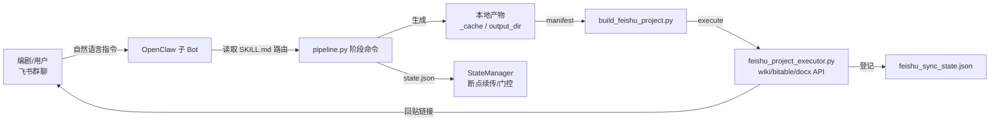

# 方寸（FangcunSkills）现状结构与问题分析

> 版本：v0.9 现状盘点  
> 日期：2026-08-07  
> 依据：`~/Downloads/fangcun-github-main-20260807-124104-49e78426.zip` 内 FangcunSkills-main 源码包逐文件核对（根 SKILL.md、skills/drama、skills/adaptation、skills/supervision、skills/dialogue-translation、agents/、hooks/、tools/、tests/、docs/）。

---

## 0. 一句话定位

方寸是一个「小说 → 短剧剧本」的 AI Agent 生产流水线，不是一次性的写剧本提示词。它把改编拆成多个阶段，每个阶段有独立产物、AI 审核、人工确认和飞书交付。主战场是 OpenClaw 远程部署 + 飞书子 Bot，用户只通过飞书群聊自然语言操作；同时希望同一套 skill 能在 Codex / Claude Code / Cursor 等 agent 上使用。

---

## 1. 运行链路总览



数据流本质：**用户 → 群聊 → Bot 调用 Python 工具 → 本地状态文件 → 飞书文档 → 群内链接 → 用户确认 → 下一阶段**。

---

## 2. 目录结构与部件职责

### 2.1 根目录

| 文件/目录 | 职责 |
|---|---|
| `SKILL.md` | 入口技能：触发词、三段式初始化、阶段铁律、飞书交付门禁、rules 路由 |
| `README.md` | 对外介绍（仍写旧流程，与现状不符） |
| `INSTALL.md` | 跨平台安装说明（Claude/Codex/Cursor/OpenCode/Gemini） |
| `DELIVERY.md` | 公司交付包流程（manifest + 校验和 + 隔离检查） |
| `ROADMAP.md` | 后续规划：资产、token 统计、台词翻译 |
| `GEMINI.md` / `gemini-extension.json` | Gemini CLI 适配 |
| `工程skill.md` | linqi0717 分支迁出的工程门禁（chat_id 复用、跨 owner 校验、禁止裸建飞书文档） |
| `agents/` | 6 个子代理定义（决策/监督/执行三层） |
| `skills/drama/` | 主引擎（见 2.2） |
| `skills/adaptation/` | 改编指引子技能 |
| `skills/supervision/` | 审核子技能 + 平台红线 |
| `skills/dialogue-translation/` | 台词翻译子技能（ROADMAP 产物） |
| `hooks/` | SessionStart 自动激活（检测项目并注入上下文） |
| `references/` | 飞书表1/表2 模板、跨平台工具映射 |
| `memory/user-preferences.md` | 用户偏好（中文 commit/README） |
| `tools/` | 公司交付工具（build_company_delivery、init_company_branch、smoke_test_delivery、check_private_isolation） |
| `tests/` | 单元测试（剧本工作流、状态管理、可移植性等） |
| `.claude-plugin/` `.cursor-plugin/` `.opencode/` `.codex/` | 各平台插件/安装说明 |

### 2.2 skills/drama（核心引擎）

```
skills/drama/
├── SKILL.md            # 引擎说明：三步走、门控、Agent Mode、飞书同步、文件发送原则
├── prompts/            # 阶段 prompt 模板（见 2.3）
├── tools/              # 纯 Python 工具链（标准库 + requests）
└── verification/       # 端到端验证样例（0021_script_format_e2e）
```

tools/ 关键文件：

| 文件 | 职责 |
|---|---|
| `pipeline.py` | 主流水线：全部 `--phase` 命令、门控、剧本草稿循环、审核、导出、翻译 |
| `fangcun.py` | 一键启动器：init / run / sync / status / report / setup |
| `state_manager.py` | 状态机：phases、episodes、script_batches、human_reviews、断点续传 |
| `script_workflow.py` | 剧本草稿批次：draft 保存、审核报告、.pass 标记、.pending 锁、提升 scripts/、连续性状态 |
| `source_analysis.py` | 事件提取（并行滑窗）、需求文档、骨架、改编策略生成 |
| `source_io.py` | 源书级 I/O：章节、事件、rules 版本化、rules 提取/确认 |
| `agent_tools.py` | 项目级 I/O：事件/骨架/策略/剧本读写、XML 解析、骨架片段提取、本地校验 |
| `lib/api_client.py` | OpenAI 兼容 API 客户端：凭据解析、模型选择、重试 |
| `build_feishu_project.py` | 飞书同步 manifest 生成器（dashboard + 阶段文档 + 剧本批次 + 汇总） |
| `feishu_project_executor.py` | 飞书执行器：wiki 节点、表1/表2、docx 创建/更新、权限、状态登记 |
| `project_ownership_guard.py` | 跨 bot/项目守卫：bot_id、账号、chat_id、项目路径四重校验 |
| `runtime_paths.py` | OpenClaw 不同代际工作区路径解析 |
| `fangcun_guardrails.py` | 项目名安全、路径边界、飞书错误中文映射、群消息净化 |
| `archive_source_txt.py` | 小说 txt → 飞书 docx 归档 |
| `asset_registry.py` | 项目资产登记 + dashboard（ROADMAP P0） |
| `drama_observer.py` / `audit_log` | 阶段事件记录 |
| 各 `*_guardrails.py` | 本地校验器：分场 scene key、电影感、创意一致性、台词风格、结构 |
| 各 `test_*.py` | 对应 guardrails 的单元测试 |

### 2.3 Prompt 体系（7 套 + 技巧库）

**drama/prompts/**

| 文件 | 用途 | 备注 |
|---|---|---|
| `event_extraction.md` | 事件提取 | 输出 7 字段管道行 |
| `requirements.md` | S0 用户需求文档 | 旧流程 |
| `decision.md` | 决策层 agent 指令 | 旧流程 |
| `story_outline.md` | 故事大纲（新故事蓝图） | 固定 10 节 |
| `skeleton.md` | 故事骨架/集纲 | 新流程叫集纲，旧流程叫骨架 |
| `adaptation.md` | 改编策略 | 与子技能 adaptation 的"改编指引"概念重叠 |
| `script.md` | 剧本编写（Toonflow 原生版） | 大量方法论 |
| `script_local.md` | 剧本编写（OpenClaw 本地模式版） | 与 script.md 并存、内容近似 |
| `script_review.md` | 单集剧本 AI 审核 | JSON 输出，阻塞条件 10 条 |
| `script_rewrite.md` | 单集定向重写 | 只修严重问题，保留原 beats |
| `continuity_update.md` | 连续性状态更新 | JSON 输出 |
| `supervision.md` | A/B/C/D 阶段审核 | 与 script_review 是两套审核体系 |
| `content_compliance.md` | 内容合规建议 | 不强制 |
| `writing-methods.md` | 写作方法论 | 供 agent 读取 |
| `craft/` | 7 个技巧模块：hook / reversal / satisfaction / abuse / expand / compress / audiovisual | 按需加载 |

**adaptation/prompts/adaptation.md**：改编指引生成（柔性提示：人物/世界观/删减/红线）。

**supervision/prompts/**：`supervision.md`（A/B/C/D 审核）+ `content_compliance.md`；references 下有真人版/动画版平台红线缓存。

**dialogue-translation/prompts/**：台词翻译 + 风格档案（话剧/黑帮/斯文古典/本土口语）。

---

## 3. 核心工作原理

### 3.1 入口与路由

- SKILL.md frontmatter 声明触发词（「用fangcun」「写剧本」「改编短剧」「分析这本书」等）。
- `hooks/session-start` 扫描工作区是否存在 `_cache/events.json` 或 `drama/` 目录，命中则注入方寸上下文和可用 agent 列表。
- 主 SKILL 文档定义自然语言路由表（初始化 / 原文归档 / 需求确认 / 各阶段 / rules 提取与采纳）。

### 3.2 项目初始化（飞书三段式第 0 步）

1. 用户说「用 fangcun」；
2. `fangcun.py init` 或 `build_feishu_project.py --execute`：
   - 优先按当前 `chat_id` 复用已有项目配置（防重名建目录）；
   - 无项目则用群名建 `projects/<slug>/drama/`，写入 config.json（含 bot_id / feishu_account / chat_id / project_slug / project_workspace / output_dir）；
   - 在飞书 wiki 根节点下建「群名项目文件夹」；
   - 创建/规范化表1（业务产物一览）与表2（tokens 消耗明细）；
   - 回贴项目文件夹、表1、表2 三个链接。

### 3.3 原文归档 + 事件提取（第 1 步）

- 用户发 txt/docx → `archive_source_txt.py` 归档为项目目录下飞书 docx 并回贴链接。
- `--phase event`：按 `第*章*.txt` 拆章，5 线程并行调 LLM，每章输出 7 字段事件行；带前 2 章摘要滑窗；增量保存到 `_cache/events.json`；成功章数 > 0 才允许后续阶段。

### 3.4 阶段产物与状态

两个存储域：

- `_cache/`（源书级）：events.json、story_outline.md、story_skeleton.md、adaptation_strategy.md、requirements.md
- `output_dir/`（项目级）：drafts/、scripts/、reviews/、state.json、project_rules.md、feishu_sync_state.json

`state.json` 记录：

- phases：每个阶段的 running / done / failed；
- episodes：单集完成/失败；
- script_batches：当前批次、已确认批次、每集审核结果、重写次数、等待确认标记；
- human_reviews：等待人工确认的 target / report / unlock_phase。

### 3.5 审核门控（两套并存）

**阶段级审核（旧流程，supervision.md）**：`--phase review --review-target <目标>` → 生成 `reviews/<target>_review.md`（A/B/C/D + 问题清单）→ 写入 `human_reviews.pending` → 必须 `--confirm-review` 才解锁下一阶段。文件级硬门禁：下一阶段要求对应审核报告存在且 >50 字节。

**剧本逐集审核（新机制，script_review.md）**：JSON 输出 verdict（pass/warning/blocked）+ 严重/非阻塞/连续性/格式问题 + 重写指令。blocked 或严重问题 → 自动定向重写一次 → 再审核 → 仍 blocked 则暂停等编剧决定。

### 3.6 剧本草稿批次（draft-first）

```
output_dir/drafts/batch_NNN/
├── ep_001.txt … ep_005.txt     # 草稿
├── reviews/                    # 每集审核 JSON + MD + .pass 标记
├── rewrites/                   # 重写历史
├── continuity_state.json       # 批次内临时连续性
├── batch_NNN.pending           # 批次锁
└── batch_summary.md
```

规则：

1. 每集串行生成 → 立即 AI 审核 → 更新连续性状态 → 才生成下一集；
2. 批次满 5 集 → 写 `.pending` 锁 → 必须 `--confirm-draft-batch` 提升到 `scripts/` 并清锁；
3. 提升只是"内部确认"，还要用户确认批次（`--confirm-user-batch`）与项目完结口令（剧本完结/项目结束）。

### 3.7 Agent Mode（默认）vs API Mode

- API Mode：pipeline 直接调 LLM 生成各阶段产物。
- Agent Mode（剧本阶段默认）：pipeline 只装配上下文（`--get-context`），agent 自己读 `prompts/script.md` + 上下文写剧本 → `--save-draft` → `--validate-draft` → agent 自审 → `--mark-pass` / `--mark-blocked`。

### 3.8 飞书同步闭环

1. `build_feishu_project.py --config ...` 扫描本地产物生成 manifest：
   - 项目信息 dashboard（元信息/rules/索引，禁放原文）；
   - 阶段文档：改编指引 / 故事大纲 / 集纲 / 事件表 / 审核报告 / 剧本批次 / 剧本汇总；
2. `--execute` 交给 `feishu_project_executor.py`：建 wiki 节点、规范化表1/表2、创建 docx（markdown convert + descendant 写入）、登记 `feishu_sync_state.json`、打印链接；
3. 默认每次同步创建新版本（`《项目名》-阶段-vYYYYMMDD-rN`），旧版永久保留；显式 `--overwrite-current` 才更新当前版本；
4. 回贴前应跑 `validate_delivery_link.py` 校验链接属于本项目资产体系（防游离文档）。

### 3.9 项目 Rules

- `project_rules.md` + `project_rules.json` 版本化存储，只对当前项目生效；
- 三种自然语言触发：直接入库（「记一下：…」）、群聊提取（「总结 rules」）、候选确认（「采纳 1,2,4」）；
- 每次产出 prompt 注入规则上下文 + 变更提醒 + 落实清单要求；
- 有负面规则词提取与校验（不要/禁止/避免…）。

### 3.10 配置与 API

config.json 核心字段：novel_name / drama_name / source_dir / output_dir / project{episodes, episode_duration, chapter_range, platform, aspect_ratio, style, paywall} / api_key / api_base_url / model / model_overrides / script_batch_size。

凭据优先级：环境变量 → config.json → OpenClaw `~/.openclaw/openclaw.json`（deepseek 或 openai-completions provider）。启动阶段做 API 连接预检。

### 3.11 观察与资产

- `drama_observer.record_phase`：阶段级事件记录；
- `audit_log`（ops_observer）：流水线步骤审计（缺失时静默降级）；
- `asset_registry`：资产登记 + dashboard（缺失时静默降级）；
- 表2 token 统计：已声明由另一专门 skill 负责，方寸内现有实现可视为冗余。

---

## 4. 现状的"理想流程"（文档说法）

```
原文 + 改编idea
  → 事件提取（events.json，硬前置门禁）
  → 改编指引（adaptation_strategy.md）→ 审核 → 人工确认
  → 故事大纲（story_outline.md，锁定人物/逻辑/矛盾）→ 审核 → 人工确认
  → 集纲（story_skeleton.md，逐集节奏/付费点/钩子）→ 审核 → 人工确认
  → 剧本草稿批次（5集）→ 逐集审核 → 批次确认 → 提升 scripts/
  → 下一批 … → 剧本汇总/完整导出（需显式口令）
```

每个阶段：本地生成 → 写飞书文档 → 读回验证 → 回贴链接 → 等用户明确确认 → 才进下一阶段。

---

## 5. 现存问题清单

### A. 流程与状态机（最严重）

| # | 问题 | 证据 | 影响 |
|---|---|---|---|
| A1 | **代码里是旧流程，文档里是新流程，两套并存** | `pipeline.py` 门控链：event → requirements → skeleton → adaptation → story_outline → script；`_run_all` 注释明确"对齐 GitHub/toonflow 主干"；主 SKILL/子技能写的是 改编指引 → 故事大纲 → 集纲 → 剧本 | Bot 实际按哪套跑取决于 agent 读了哪个文件，阶段顺序不稳定 |
| A2 | **state.json 的 PHASE_ORDER 与两套流程都不一致** | `PHASE_ORDER = [event, skeleton, skeleton_review, adaptation, adaptation_review, script, export]`，没有 requirements / story_outline / review | `--phase resume` 断点续传会走错位置 |
| A3 | **story_outline 是硬接在旧流程上的补丁** | 代码要求 story_outline 之前必须有 adaptation 的审核报告；文档要求 adaptation（指引）在大纲之前 | 顺序与依赖互相矛盾 |
| A4 | **同一概念多个名字** | skeleton 同时叫"故事骨架"和"集纲"；adaptation 同时叫"改编指引"和"改编策略"；requirements 与"需求确认"并存；manifest 里 events 排在大纲之后 | 用户和 agent 都容易误解当前在哪一步 |
| A5 | **人工确认只能靠 CLI + 特定话术** | `--confirm-review` / `--confirm-draft-batch` / 完结口令；飞书群内没有结构化交互 | 用户不知道说什么、打错话术就卡死；Bot 断线重连后状态停在 pending |
| A6 | **门控可被绕过** | `--skip-review-gate`、`--skip-draft-review`、`--phase all`（虽文档禁止） | 跳步时无代码兜底，质量门禁形同虚设 |

### B. 源真相 / 数据一致性

| # | 问题 | 证据 | 影响 |
|---|---|---|---|
| B1 | **本地产物与飞书文档双轨，人工修订不回灌** | 编剧在飞书 docx 手动改；本地 drafts/scripts/continuity_state.json 仍是 AI 版本；"Fresh Feishu document workflow"只是 SKILL 文档里的 prompt 约定，没有 diff/回灌代码 | Bot 续写拿不到编剧改过的内容 → 承接断裂、不按最新集纲 |
| B2 | **没有"导入编剧自己的集纲/前几集"通道** | pipeline 只读 `_cache/` 内固定文件名 | 编剧在别处写好内容后只能绕路 |
| B3 | **版本爆炸** | 默认每次同步新建版本、旧版永久保留 | 多轮修改后文档树很长，编剧找不到当前版本 |
| B4 | **完结链路复杂** | 最终交付要求：批次内部确认 + 用户确认批次 + 完结口令，三者缺一不可 | 用户漏说一个口令就永远不导出 |

### C. 质量与遵循度

| # | 问题 | 证据 | 影响 |
|---|---|---|---|
| C1 | **集纲粒度不足** | skeleton prompt：≤20集逐集展开，>20集"总览+关键集展开" | 大部分集数在剧本阶段没有逐集契约 → 剧本自由发挥 → "不按集纲写" |
| C2 | **没有"批次集纲"概念** | 只有全局集纲一个粒度；`extract_episode_from_skeleton` 靠正则切段，复杂格式提取可能失败 | 编剧自发"5集集纲+5集剧本"，但系统不支持 |
| C3 | **剧本 prompt 过载且有两份** | script.md（Toonflow 版）与 script_local.md（本地版）并存；几十条方法论 + 平台铁律 + 合规 + 项目 rules 混在一条 prompt | 指令稀释，模型遵循度下降；两份文件还可能互相冲突 |
| C4 | **"短密紧"与"不简陋"冲突** | script_local：正文字数 ≤ 目标 1.6 倍、绝不超过 2 倍 | 压缩过头 → 输出简陋、情绪/台词展开不足 |
| C5 | **审核同源且偏格式** | 生成与审核同模型；script_review 阻塞条件以格式/机械项为主，语义与台词自然度靠自评；supervision（A/B/C/D）与 script_review（JSON）两套审核并存 | 语义漂移、台词生硬容易被放过；审核结论也不统一 |
| C6 | **重写模式单一** | script_rewrite 明确"不自由重写另一版、保留原 beats" | 编剧要"换方向/换风格"时没有模式，只能 3-4 轮硬修不收敛 |
| C7 | **无风格锚点机制** | 没有把编剧改好的 1-2 集作为 few-shot 样本的通道 | 个人风格无法传递，AI 始终是"通用腔" |
| C8 | **上下文截断衰减** | 上一集只取 3000 字、事件表只取 2000 字、原文每章 2000 字；continuity_state 由 LLM 生成，质量不稳定 | 越往后集，信息越少 → 承接/连续性变差 |
| C9 | **项目 Rules 落实靠提示** | 要求"每次产出末尾写项目规则落实清单"，但没有自动校验（只有负面词提取） | 规则容易被忽略 |

### D. 飞书交付

| # | 问题 | 证据 | 影响 |
|---|---|---|---|
| D1 | **模板 token 写死在代码/文档里** | `NNfBwb32...` wiki 根、表模板 URL 硬编码；分发规则又说不得携带表 token | 换租户/新部署必挂；与"分发隔离"规则自相矛盾 |
| D2 | **路径表述不一致** | 文档写 `skills/fangcun/skills/drama/tools/...`，实际结构是 `skills/drama/tools/...`；runtime_paths 又要求外层目录名必须是 `fangcun` | 远程部署时命令找不到文件 |
| D3 | **初始化失败静默** | `_ensure_bitable_fields` / `_safe_create_bitable_record` 大量 `except: pass` | 表建错/没建好也继续，用户看到链接但表是坏的 |
| D4 | **群名 vs 剧名规则冲突** | 铁律"必须用群名建项目文件夹"；但 fangcun.py init 的 slug 用传入 name（实际可能是剧名），update_group_name_snapshot 又保留群名快照 | 项目目录名与飞书文件夹名可能不一致 |
| D5 | **事件表/正文格式兜底分散** | 飞书 docx 表格转换不可靠 → 多处手写列表转换 + 读回抽检要求 | 交付质量依赖 agent 是否真的执行读回验证 |
| D6 | **链接校验依赖 agent 自觉** | validate_delivery_link.py 存在，但"回贴前必须跑"只是文档要求 | 不跑也没代码拦截 |

### E. 代码与工程

| # | 问题 | 证据 | 影响 |
|---|---|---|---|
| E1 | **双入口并存** | fangcun.py 与 pipeline.py；默认 batch_size 一处 3、一处 5 | 命令混用，行为不一致 |
| E2 | **大量 legacy 兼容层** | 旧 CLI 结构检测、legacy config 提示、_cache 多级路径猜测、旧流程 prompt 全部保留 | 维护成本高，行为难预测 |
| E3 | **重复实现** | agent_tools 与 source_io 都有事件/骨架读写；supervision.md 与 script_review.md 两套审核 | 改一处漏一处 |
| E4 | **与核心无关的模块堆积** | token 统计、资产 dashboard、公司交付、台词翻译、rules 提取、6 个 agent、多个 hooks | 偏离"质量+遵循"这一核心问题；skill 越大，模型注意力越分散 |
| E5 | **测试是理想路径** | 测试 mock 了连续 pass 的 happy path；无真实飞书端到端测试 | 实际故障（权限、格式、同步）无法回归 |
| E6 | **编码问题** | zip 内 `工程skill.md` 文件名乱码；Windows 路径补丁存在但未验证 | 分发与跨平台有隐患 |

### F. 与编剧真实工作流的冲突

| 编剧实际做法 | 方寸现状 | 后果 |
|---|---|---|
| 出 5 集集纲 → 出 5 集剧本（批次推进） | 只有全局集纲 | 没有对应的粒度与契约 |
| 第一集不满意反复改 3-4 遍 | 每轮都要"改 → 审 → 重写 → 等人确认"的串行往返 | 一轮次小时级，周期爆炸 |
| 改飞书文档，让 Bot 结合修改后续写 | 无回灌机制，Bot 续写读的是本地旧版 | 承接断裂，越改越乱 |
| 自己在别处写集纲/前几集，让 AI 接手 | 无导入通道 | 只能绕路，且绕路后 AI 拿不到上下文 |
| 要求"换个方向/风格"重写 | 只支持"修严重问题"的定向重写 | 不收敛，最终人工接管 |

---

## 6. 结论：为什么现在"不稳跟集纲、输出简陋、乱写"

三条直接因果链：

1. **集纲没有细到"每集契约"** → 剧本阶段没有可遵循的具体指令 → 自由发挥（不按集纲写）。
2. **编剧修订与 AI 上下文脱节（双轨）** → 续写不知道编剧改了什么、现在哪个版本是真相 → 承接断裂（集与集接不上）。
3. **审核同源、重写单一、人工确认串行** → 低质量集反复修不收敛 → 编剧手动改 + 周期拉长到 7-8 天。

结构性结论：**现状 = 旧 Toonflow 引擎 + 飞书交付补丁 + 大量铁律的叠加**。它的核心矛盾是「AI 是生产者、人是审批者」的流水线假设，与「编剧是作者、AI 是续写提效工具」的真实协作模式冲突。平台（OpenClaw + 飞书）本身不降低质量，但它把异步人工等待、双轨文件、prompt 污染这三个问题放大了。

---

## 7. 改版前需要对齐的开放问题

1. 新目标流程是否建议为：需求 → 改编指引 → 故事大纲 → **批次集纲** → **批次剧本** → 人工修订回灌 → 续写？
2. 飞书文档是否作为**协作源真相**（人工改完即基准）？本地状态如何 diff 回灌？
3. 哪些模块砍掉或移出主包：token 统计、资产 dashboard、公司交付、台词翻译、6 个 agent、rules 提取？
4. "一个 skill 跨平台"的边界：平台规则（飞书铁律）应放到注入层，而不是创作 prompt 内。
5. 审核与重写：是否引入"换方向重写"模式 + 风格锚点（编剧修订稿作为 few-shot）？

