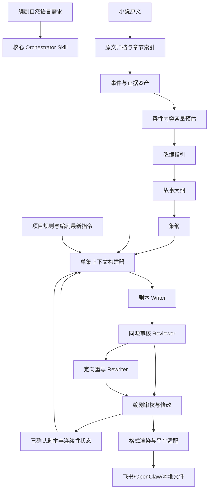

# 新版 Fangcun 小说转剧本 Skill 系统设计规格书

> 文档性质：AI Agent 开发交接版 / 产品需求与技术设计统一规格  
> 目标读者：负责设计、开发、重构或测试新版 Fangcun 的任意 AI Agent 与工程人员  
> 当前状态：设计基线 v1.0  
> 核心范围：小说原文 → 改编指引 → 故事大纲 → 集纲 → 剧本 → 审核与修改承接  
> 暂不作为核心目标：Token 统计、主 Bot 管理、飞书表格统计、运营 Dashboard

---

## 0. 如何使用本规格书

本文件是新版小说转剧本 Skill 的规范性设计，不依赖 OpenClaw、Codex、Claude Code、Cursor 或任何特定 Agent 平台。开发 Agent 应把本文件视为唯一的产品和系统设计基线。

开发时必须遵守以下使用原则：

1. 先实现本规格书中的通用创作核心，再接入 OpenClaw、飞书或其他平台。
2. 不把某一份编剧定稿当成所有题材的唯一写法；真实样本只用于验证通用缺陷是否被修复。
3. 不推翻当前反馈较少的改编指引和故事大纲能力；首轮重点重构集纲到剧本链路。
4. 创意判断保持柔性，事实、版本、上下文和格式处理保持确定性。
5. 内容容量和时长估算只帮助编剧建立预期，不作为强制回退门禁。
6. 编剧拥有最终决定权。AI 可以提示风险，但不能擅自把项目退回最初阶段。
7. 所有阶段都必须能被替换、单独调用和单独测试；禁止把整套逻辑塞入一个超长 Prompt。

若本规格书与旧 Fangcun 中的 Prompt、说明文档或代码行为冲突，以本规格书为新版实现目标；旧行为仅用于兼容和迁移。

---

## 1. 业务背景

Fangcun 最初是部署在 Agent 上的小说仿写 Skill，后被改造成小说转短剧剧本系统。真实生产环境主要使用 OpenClaw：

- 服务器部署一个主 Bot；
- 主 Bot 管理多个编剧子 Bot；
- 每位编剧使用自己的子 Bot；
- 子 Bot 与飞书群、飞书文档和评论体系打通；
- 编剧在项目群里与 Bot 对话，安装和使用 Skill；
- 各阶段产物同步到飞书文档；
- 编剧可能在群聊、文档批注或手动上传文件中修改剧本。

旧 Fangcun 经历过多轮需求叠加：

1. 从小说仿写流程改成小说转剧本流程；
2. 调整改编指引、故事骨架、集纲和剧本顺序；
3. 增加各阶段 AI 审核和人工确认；
4. 增加批量剧本生成和 Agent 模式；
5. 增加飞书统一文档、状态记录和 Token 统计；
6. 在不同 Bot 中持续堆叠补丁。

结果是内容创作规则、状态管理、飞书交付规则、审核门控和统计逻辑互相混杂，形成多套阶段顺序、多套剧本格式、多套时长口径和多份重复 Prompt。

---

## 2. 当前已确认的核心问题

### 2.1 内容效果问题

当前问题主要集中在集纲到剧本：

- 剧本会偏离原文，擅自新增动作、情节、人物反应或设定；
- 剧本未严格按照集纲执行，模型保留情节点却重新组织故事；
- 台词过短、过于机械、缺少人物声音；
- 台词前后衔接不上；
- 保留了金句或包袱，却删除了铺垫；
- 删除了人物获得信息、作出判断和行动的认知过程；
- 因果链被压缩成几个结果，观众无法理解人物为什么这样说、这样做；
- 剧本审核看不到与生成阶段相同的原文证据，无法发现真实偏离；
- 自动重写同样缺少原文，可能用新的自由发挥修复旧的自由发挥。

### 2.2 使用流程问题

- 编剧不一定完整生成全部集纲后再写剧本；
- 编剧可能按“2 集集纲 + 2 集剧本”滚动生产；
- 单集剧本经常修改 7—8 版；
- 修改可能来自群聊、飞书评论、文档正文或手动文件；
- 编剧确认的最新剧本可能与旧集纲不一致；
- 后续剧本仍可能读取旧集纲，造成事实冲突；
- 一些编剧最终绕过 Fangcun，直接使用通用 LLM 修改文本；
- 原计划一天一本，实际可能需要 7—8 天。

### 2.3 架构问题

- 同一 Skill 中存在互相矛盾的阶段顺序；
- 创作方法被全量注入，而不是按需加载；
- `script.md`、`script_local.md` 和多份写作方法重复或冲突；
- 剧本生成、审核和重写使用不同上下文；
- 原文只按固定长度或平均章节范围截取，未按集纲锚点检索；
- 台词每分钟字数和剧本正文每分钟字数混用；
- XML 传输格式和编剧业务格式混为一谈；
- Validator 擅长查格式，不能查人物认知、台词配对和因果完整性；
- 飞书、Token、文档同步规则占据大量创作上下文；
- 编剧修改后的事实优先级不清晰。

---

## 3. 新版目标

### 3.1 首要目标

新版首先解决“集纲到剧本”的可用性：

1. 剧本主干贴合原文和已确认改编决策；
2. 剧本严格消费当前集纲，不擅自重开故事；
3. 台词具备完整刺激、回应、反应和结果；
4. 人物只能依据当前已知信息说话和行动；
5. 审核能基于同一份原文证据发现真实问题；
6. 编剧确认的最新剧本能正确影响后续集数；
7. 不同题材通过按需 Craft 模块获得风格差异；
8. 输出格式统一、可配置、可转换；
9. 小范围修改就地处理，不强制返回前期；
10. 系统明显减少人工重写和反复迭代。

### 3.2 次要目标

- 在改编开始前提供原著内容容量、推荐集数和推荐时长区间；
- 支持编剧调整集数、时长、删减范围和结局覆盖；
- 在集纲和剧本阶段动态更新总时长预期；
- 支持不同 Agent 平台和模型提供商；
- 保持与旧 Fangcun 项目文件的兼容迁移能力。

### 3.3 非首轮目标

以下能力必须预留接口，但不应进入第一轮内容质量重构：

- Token 消耗汇总；
- 主 Bot 扫描所有子 Bot；
- 公司级进度 Dashboard；
- 飞书多维表格统计；
- 成本核算；
- 自动投放和运营分析；
- 复杂向量数据库或重型知识图谱。

---

## 4. 规范性设计原则

以下原则是新版的最高级规则。

### 4.1 编剧最终裁量

- AI 提供分析、方案、风险和建议；
- 编剧决定集数、时长、删减、重构、结局和具体写法；
- AI 不得因为预测偏差自动回退整个项目；
- AI 认为修改影响很大时，只能说明影响并询问；
- 只有编剧明确要求“整体重做”“从改编指引重新来”等操作时，才进行全局重规划。

### 4.2 原文证据优先

- 任何重大事件、人物、身份、关系、设定和反转都必须有原文依据或已确认改编依据；
- 原文关键台词可用时优先复用，压缩不得改变说话习惯和语义；
- 无依据的过桥动作可以有限补充，但不得改变人物动机和事件结果；
- 任何主动偏离原文的改动必须记录“改编依据”。

### 4.3 过去事实与未来计划分离

- 已确认剧本描述“已经发生的事实”；
- 集纲描述“未来准备发生的计划”；
- 已确认剧本与旧集纲冲突时，已确认剧本对过去事实具有更高优先级；
- 系统更新未来集数，不强制重写所有上游文档；
- 原始集纲保留历史版本，不静默覆盖。

### 4.4 创作柔性、系统确定性

适合 LLM 自由判断的内容：

- 台词措辞；
- 场面调度；
- 情绪表达；
- 类型化创作；
- 钩子方案；
- 删减和合并建议。

必须由程序或结构化状态保证的内容：

- 文件路径和版本；
- 当前有效产物；
- 人物已知信息；
- 已发生事件；
- 原文对应章节；
- 审核输入完整性；
- 输出格式解析；
- 编剧确认状态；
- 后续上下文使用哪一版。

### 4.5 通用底线与类型方法分离

所有题材共用的底线：

- 原文贴合；
- 因果完整；
- 人物认知正确；
- 集纲落实；
- 台词可理解；
- 格式可交付；
- 连续性正确。

按题材选择的柔性方法：

- 喜剧；
- 甜宠；
- 虐恋；
- 复仇；
- 悬疑；
- 家庭伦理；
- 男频升级；
- AI 动画或真人短剧视听方式。

禁止把所有 Craft 全量加载给每一集。

### 4.6 预估不是门禁

- 内容容量、推荐集数和时长都是预估；
- 预估应提供区间、假设和置信度；
- 超出预期时提示保留、压缩、拆集或增加集数方案；
- 编剧选择保留后继续生产，不回退；
- 实际时长预测可随剧本完成情况动态更新。

### 4.7 单一事实源与可追溯覆盖

每个阶段必须存在一个机器可读的当前有效版本，同时保留旧版本：

- 不通过复制粘贴多个 Markdown 猜测哪一版有效；
- 不依赖聊天上下文长期记忆；
- 每次覆盖必须记录来源、时间、操作者和影响范围；
- 人类可读文档与机器状态应从同一份结构化数据渲染。

---

## 5. 总体架构



### 5.1 分层

系统分为五层：

1. **Orchestration 层**：理解用户意图、选择阶段、组织工具，不写具体业务规则大全。
2. **Creative Core 层**：改编、故事、集纲、剧本、审核和重写。
3. **Deterministic Runtime 层**：文件、状态、版本、检索、格式、校验、连续性。
4. **Provider Adapter 层**：OpenAI、DeepSeek、宿主 Agent 直接写作或其他模型调用。
5. **Platform Adapter 层**：OpenClaw、飞书、Codex、本地 CLI 等交付环境。

Creative Core 不得直接包含飞书表格字段、Bot ID、Token 表、具体文档 Token 或平台专属工具名。

---

## 6. 建议 Skill 包结构

```text
fangcun-next/
├── SKILL.md
├── agents/
│   └── openai.yaml
├── references/
│   ├── business-principles.md
│   ├── workflow.md
│   ├── screenplay-format.md
│   ├── dialogue-quality.md
│   ├── review-rubric.md
│   ├── genre-router.md
│   ├── revision-policy.md
│   ├── platform-adapters.md
│   ├── schemas/
│   │   ├── project-config.schema.json
│   │   ├── source-event.schema.json
│   │   ├── episode-outline.schema.json
│   │   ├── episode-context.schema.json
│   │   ├── continuity-state.schema.json
│   │   ├── revision-request.schema.json
│   │   └── review-report.schema.json
│   └── genres/
│       ├── comedy.md
│       ├── romance.md
│       ├── revenge.md
│       ├── suspense.md
│       ├── family.md
│       └── male-progression.md
├── scripts/
│   ├── project_cli.py
│   ├── source_ingest.py
│   ├── source_retriever.py
│   ├── capacity_estimator.py
│   ├── context_builder.py
│   ├── prompt_router.py
│   ├── script_validator.py
│   ├── continuity_manager.py
│   ├── revision_manager.py
│   ├── format_renderer.py
│   └── migration.py
├── assets/
│   └── screenplay-templates/
│       ├── default-cn.txt
│       └── legacy-scriptitem.txt
└── tests/
    ├── unit/
    ├── regression/
    └── smoke/
```

约束：

- `SKILL.md` 尽量控制在 500 行以内，只保留触发条件、核心流程、工具路由和最高规则；
- 详细方法放入 `references/`，按需加载；
- 确定性逻辑写入 `scripts/`，不能只用 Prompt 描述；
- 不创建重复的 README、快速指南或变更日志；
- 类型模块不得复制通用规则。

---

## 7. 标准产物命名

新版统一概念，避免“故事骨架”和“集纲”混用：

| 中文名称 | 机器名称 | 含义 |
|---|---|---|
| 项目需求 | `project_brief` | 编剧要求、体量、平台、风格、保留和禁改项 |
| 原文事件资产 | `source_events` | 原文事件、台词、人物认知和因果证据 |
| 容量预估 | `capacity_forecast` | 推荐集数、时长区间和删减压力，只供参考 |
| 改编指引 | `adaptation_strategy` | 改编方向、删减原则、人物和世界观调整 |
| 故事大纲 | `story_outline` | 改编后整部故事的主线、人物关系、结局和结构 |
| 集纲 | `episode_outline` | 每集具体发生什么、如何承接、以什么钩子结束 |
| 单集创作契约 | `episode_contract` | 从集纲和原文自动组装的当前集执行包 |
| 剧本草稿 | `script_draft` | AI 初稿或修改稿 |
| 剧本定稿 | `approved_script` | 编剧确认的当前有效剧本 |
| 连续性状态 | `continuity_state` | 已发生事实、人物认知、关系、伏笔和钩子 |
| 修改请求 | `revision_request` | 群聊、评论或文件中的修改意见 |
| 审核报告 | `review_report` | 事实、因果、集纲、台词、连续性和格式问题 |

旧项目兼容映射：

```text
story_skeleton.md（旧） → episode_outline.md（新）
scripts/ep_NNN.txt      → approved_scripts/ep_NNN.txt
continuity_state.json   → state/continuity.json
```

迁移时保留旧文件，不原地删除。

---

## 8. 标准工作流

### 8.1 推荐流程

```text
项目需求确认
→ 原文归档与事件提取
→ 柔性容量预估
→ 改编指引
→ AI 同源审核与编剧确认
→ 故事大纲
→ AI 同源审核与编剧确认
→ 集纲
→ AI 同源审核与编剧确认
→ 按任意批次生成剧本
→ AI审核
→ 编剧修改与确认
→ 更新连续性
→ 继续后续集数
```

### 8.2 流程必须支持的变体

- 全部集纲完成后再写剧本；
- 2 集集纲 + 2 集剧本滚动生产；
- 一次只写 1 集；
- 先生成 5 集，再逐集精修；
- 编剧手动上传自己的版本作为定稿；
- 编剧在飞书正文修改；
- 编剧通过评论要求局部修改；
- 编剧接受超时，不压缩；
- 编剧临时增加或减少少量集数；
- 编剧明确要求大改时重做整体规划。

### 8.3 不允许的自动行为

- 因某一集超时自动退回改编指引；
- 因剧本与集纲不同自动覆盖编剧定稿；
- 因 AI 审核不满意无限重写；
- 因类型方法要求擅自新增反转、人物或支线；
- 未读取最新飞书正文或评论就从旧本地文件继续；
- 未经编剧确认将 AI 草稿标记为最终事实。
- AI 阶段输出省略生成时的输入哈希，或用人工导入参数自行批准；
- 上游产物或项目配置改变后，继续消费旧阶段输出。
- 在生成或审核阶段产物的同一 Agent 回合内代替编剧执行确认；测试目标、批量运行要求或 Agent 自填身份均不视为人工确认。

标准单集默认只执行一次 Writer 生成与一次 Reviewer 审核；快速草稿模式只执行
Writer 一次，标记为 `unreviewed_draft`，不得标记已审核或更新连续性。自动重写
默认关闭，只有编剧明确要求时签发一次性 rewrite ticket。

### 8.4 创作规划阶段统一门禁

改编指引、故事大纲、集纲统一采用四步状态机：

1. 生成不可变 `stage_context`，绑定项目实例、配置哈希、上游逻辑版本和内容哈希；
2. AI 输出携带同一 `stage_context_hash` 保存，初始状态固定为 `needs_writer_confirmation`；
3. Reviewer 对同一阶段版本和上下文审核，报告绑定 `stage_context_hash + artifact_version + artifact_hash`；
4. 只有审核结论为 pass/warning 后，编剧才能把该逻辑版本确认为 `approved`。

配置或任一上游绑定变化后，旧产物视为 stale。下游阶段不得启动。人工导入/审核 override 只能响应编剧明确指令，必须记录理由，不能作为 Agent 自动降级路径。

---

## 9. 阶段职责

### 9.1 项目需求阶段

输入：

- 原著文件；
- 编剧自然语言要求；
- 初步集数；
- 单集最低时长或字数；
- 总时长下限；
- 目标平台和画幅；
- 风格和题材；
- 是否要求抵达原著结局；
- 必须保留、可以删改和禁止改动的内容。

输出：`project_brief.json` 与人类可读版本。

规则：

- 用户未明确的高风险要求标记待确认；
- 不要求编剧填写复杂表格，Agent 从自然语言结构化；
- 初始集数和时长只是预期，除非编剧明确声明为硬要求。

### 9.2 原文归档与事件资产阶段

目标不是生成创作方案，而是建立可追溯证据。

必须产出：

- 章节索引；
- 每章文本位置；
- 事件单元；
- 关键原句；
- 人物出场；
- 人物认知变化；
- 事件前置依赖；
- 后续回收关系；
- 建议最短和理想呈现时长；
- 是否主线、支线或过渡。

禁止只为每章提取一个事件。如果一章包含多个独立行动结果，必须拆为多个事件单元。

### 9.3 内容容量预估阶段

只提供预期，不做创作门禁。详细规则见第 15 章。

### 9.4 改编指引阶段

沿用现有业务价值，重点增加：

- 容量预估摘要；
- 供编剧选择的改编方案；
- 编剧确认的删减和覆盖范围；
- 每项主动改编的依据；
- 忠实度策略；
- 台词策略。

改编指引仍是柔性蓝图，不直接写逐集内容。

### 9.5 故事大纲阶段

锁定宏观故事：

- 故事核；
- 主线；
- 核心人物关系；
- 主要矛盾；
- 重要转折；
- 结局方向；
- 删除或合并后的支线；
- 人物弧线和秘密揭露顺序。

首轮重构不主动改变现有故事大纲能力，但必须输出机器可消费的结构化摘要。

### 9.6 集纲阶段

集纲是当前重点之一。它不能只写“本集发生哪些情节点”，还要提供剧本执行所需的最小合同。

每集必须包含：

- 集数和标题；
- 对应原文章节、事件 ID 或改编依据；
- 开场承接；
- 本集核心目标；
- 必须保留事件；
- 不可拆散因果链；
- 人物开场认知；
- 人物结尾认知；
- 关键台词候选及出处；
- 允许压缩、合并和删除项；
- 禁止新增项；
- 集末钩子；
- 建议时长；
- 与下一集的接口。

集纲合同 V2 在同一次集纲生成中产出，不新增独立模型阶段：

- `episode_focus`：本集观众记忆中心，可涵盖多个相关事件；
- `required_story_beats`：不可省略的剧情变化，绑定事件 ID 或改编决策 ID；
- `required_quotes`：必须保留或必须成对保留的原文台词，绑定事件 ID 与 pair_id；
- `project_rule_refs`：只引用当前项目已确认规则 ID，不复制规则正文；
- `optional_beats`：可压缩、删除或延后内容；
- `beat_plan`：事件呈现计划（function、presentation、时长估计、进入/可见结果、
  `required_visual_beats`）；
- `overflow_options`：`compress` / `defer` / `accept_overflow` 选择。

旧 `must_keep` 继续可读取和验证，但新版本不再把项目规则、柔性风格或关系边界
混入其中；迁移旧集纲时无法可靠分类的条目标记为 `legacy_unspecified`，不修改
历史版本文件。

### 9.7 剧本阶段

剧本 Writer 只能执行当前 `episode_contract`，不得重新设计全剧。

Writer 必须：

1. 先确认本集必须发生的事件；
2. 建立人物认知链；
3. 建立刺激—回应—反应—结果的台词与动作链；
4. 选择需要的类型 Craft；
5. 对照原文关键台词；
6. 写出完整可拍场景；
7. 保留集末钩子；
8. 输出纯业务剧本文本。

### 9.8 审核与重写阶段

Reviewer 和 Rewriter 必须收到与 Writer 相同的单集上下文。详细规则见第 17 章。

### 9.9 编剧修改与后续承接阶段

编剧确认的剧本成为该集最高事实。详细规则见第 18 章。

---

## 10. 数据契约总则

所有关键状态必须同时提供：

- 机器可读 JSON；
- 人类可读 Markdown/TXT；
- 当前有效版本指针；
- 版本历史；
- 生成或修改来源；
- 时间戳；
- 编剧确认状态。

不要让 LLM 通过解析自由格式 Markdown 判断当前版本。Markdown 是展示层，JSON 是状态层。

集纲 JSON 是唯一机器事实源；每次保存必须由 Renderer 自动生成带相同 `outline_sync_id` 的可读 Markdown。禁止由模型分别维护 JSON 和 Markdown 两份可能漂移的集纲。

### 10.1 项目配置示例

```json
{
  "project_id": "fc-demo-001",
  "novel_name": "原著名",
  "drama_name": "剧名",
  "platform": "竖屏短剧",
  "aspect_ratio": "9:16",
  "genre": ["喜剧", "甜宠", "脑洞"],
  "initial_episode_count": 30,
  "minimum_episode_seconds": 60,
  "minimum_total_seconds": 1800,
  "preferred_episode_seconds": [60, 100],
  "preferred_total_seconds": null,
  "source_scope": {"start_chapter": 1, "end_chapter": 340},
  "reach_original_ending": true,
  "fidelity": "medium",
  "dialogue_policy": "prefer_original",
  "review_policy": "advisory_with_writer_confirmation",
  "script_format": "default-cn",
  "writer_has_final_authority": true
}
```

注意：

- `minimum_*` 是编剧或平台声明的下限；
- `preferred_*` 是建议区间，可为空；
- 不自动把建议区间升级为硬限制；
- 后续调整保留版本记录。

### 10.2 原文事件单元示例

```json
{
  "event_id": "CH001-E03",
  "chapter_id": 1,
  "source_span": {"start": 820, "end": 1683},
  "characters": ["叶聆", "谢淮舟", "996"],
  "event": "牵手任务失败后雷击错误落到谢淮舟身上",
  "trigger": "996发布五秒内牵手任务",
  "actions": [
    "谢淮舟明确拒绝爱上叶聆",
    "叶聆挑衅系统",
    "倒计时结束"
  ],
  "result": "雷击谢淮舟而不是叶聆",
  "required_reactions": ["叶聆震惊", "996发现绑错惩罚对象"],
  "knowledge_changes": {
    "叶聆": ["惩罚可能落到谢淮舟"],
    "谢淮舟": ["能听见系统声音"],
    "996": ["惩罚对象绑定错误"]
  },
  "dependencies": ["CH001-E01", "CH001-E02"],
  "payoffs": ["系统错绑规则", "后续通感关系"],
  "key_quotes": [
    {"speaker": "叶聆", "text": "你有本事就劈死我", "must_preserve_pairing": true}
  ],
  "importance": "mainline",
  "minimum_screen_seconds": 20,
  "preferred_screen_seconds": 35,
  "adaptation_options": ["full", "compress"],
  "confidence": 0.85
}
```

### 10.3 集纲单集结构示例

```json
{
  "episode": 1,
  "title": "系统绑错人",
  "source_event_ids": ["CH001-E01", "CH001-E02", "CH001-E03"],
  "source_chapters": [1],
  "opening_bridge": "谢淮舟提出录完恋综后离婚",
  "episode_goal": "建立叶聆退休穿书、996出现、谢淮舟能听见系统及惩罚错绑规则",
  "must_keep": [
    "叶聆刚完成任务退休",
    "谢淮舟能听见996",
    "五秒牵手任务",
    "任务失败后雷劈谢淮舟"
  ],
  "causal_chains": [
    ["系统发布任务", "谢淮舟拒绝", "倒计时失败", "叶聆挑衅", "雷击错绑", "三方反应"]
  ],
  "knowledge_at_start": {
    "叶聆": ["自己完成快穿任务准备退休"],
    "谢淮舟": ["准备与叶聆离婚"]
  },
  "knowledge_at_end": {
    "叶聆": ["系统惩罚错误作用于谢淮舟"],
    "谢淮舟": ["能听见996并会受任务惩罚"]
  },
  "dialogue_anchors": [
    {"setup": "吃得苦中苦，你就能得到——", "payoff": "吃不完的苦。", "source": "第1章"}
  ],
  "allowed_compression": ["退休背景可用短闪回表现"],
  "forbidden_additions": ["无依据的新人物", "改变系统可被听见的规则"],
  "ending_hook": "996承认绑错惩罚对象",
  "suggested_seconds": [90, 130],
  "writer_notes": []
}
```

### 10.4 单集上下文包示例

```json
{
  "episode": 1,
  "project_brief": {},
  "adaptation_summary": {},
  "story_summary": {},
  "episode_outline": {},
  "source_evidence": {
    "chapter_ids": [1],
    "events": [],
    "quotes": [],
    "raw_excerpts": []
  },
  "previous_approved_script": null,
  "continuity_state": {},
  "writer_overrides": [],
  "selected_craft_modules": ["comedy", "romance"],
  "format_profile": "default-cn",
  "advisory_timing": {
    "minimum_seconds": 60,
    "preferred_seconds": [90, 130]
  }
}
```

Writer、Reviewer 和 Rewriter 必须消费同一个 `episode_context` 文件或同一对象的不可变快照。

### 10.5 连续性状态示例

```json
{
  "version": 12,
  "updated_from_episode": 8,
  "approved_episodes": [1, 2, 3, 4, 5, 6, 7, 8],
  "facts": [
    {"fact": "谢淮舟能听见996", "introduced_in": 1, "status": "active"}
  ],
  "character_knowledge": {
    "叶聆": ["系统惩罚会落到谢淮舟"],
    "谢淮舟": ["能听见996", "暂不知道叶聆的快穿经历"]
  },
  "character_states": {},
  "relationship_states": {},
  "open_hooks": [],
  "resolved_hooks": [],
  "props": {},
  "locations": {},
  "writer_overrides": [],
  "notes_for_future": []
}
```

---

## 11. 事实与指令优先级

不能使用一个简单的全局优先级覆盖所有情况，应按领域判断。

### 11.1 创作意图优先级

```text
编剧最新明确指令
> 编剧确认的当前阶段产物
> 已确认的项目规则
> 系统建议
> 通用类型方法
```

### 11.2 已发生剧情事实优先级

```text
编剧确认的最新剧本
> 编剧确认的手动改稿
> 连续性状态
> 旧集纲对该集的计划
```

### 11.3 原文与改编关系

```text
有明确编剧改编指令：按指令改，并记录依据
无明确改编指令：原文事实优先
改编指引与原文冲突：需要显式记录冲突和选择
模型不能以“短剧节奏”为理由静默改变关键事实
```

### 11.4 未来计划优先级

```text
编剧针对未来集数的最新要求
> 受已确认剧本影响后的 episode override
> 当前有效集纲
> 故事大纲
> 改编指引
```

---

## 12. 单集上下文构建器

这是新版最关键的确定性模块之一。

### 12.1 输入

- 项目配置；
- 当前集集纲；
- 原文事件资产；
- 改编指引摘要；
- 故事大纲摘要；
- 上一集或必要前集的已确认剧本；
- 连续性状态；
- 编剧最新修改；
- 类型和平台配置。

### 12.2 原文检索规则

按以下顺序检索：

1. 集纲明确记录的事件 ID；
2. 集纲明确记录的章节；
3. 集纲关键人物、事件和台词关键词；
4. 前置依赖事件；
5. 必要的前后文；
6. 无法定位时才按全剧比例回退。

禁止默认把原文前 3000 字作为所有集的证据。禁止只按“总章节数 ÷ 总集数”平均分配章节。

### 12.3 截取策略

- 短章节尽量提供完整原文；
- 长章节优先保留事件起因、动作、结果、人物反应和关键台词；
- 不从一句台词中间截断；
- 不拆散 setup/punchline；
- 原文超出模型上下文时，先按事件分块，不直接硬截；
- 所有摘录标注章节和位置。

### 12.4 上下文完整性检查

构建完成后必须验证：

- 当前集有集纲；
- `must_keep` 非空；
- 每个 `must_keep` 至少有原文依据或改编依据；
- 当前集对应原文证据非空；
- Reviewer 和 Rewriter 能读取同一上下文快照；
- 上一集钩子和当前集开场承接均可见；
- 编剧最新修改已写入。

缺少原文时应提示，而不是让模型自由补写。

---

## 13. Prompt 分层与路由

### 13.1 Prompt 层级

每次创作调用最多包含以下七层：

1. **通用系统底线**：忠实、因果、认知、集纲、纯输出；
2. **当前阶段职责**：Writer / Reviewer / Rewriter；
3. **项目需求**：题材、平台、编剧要求；
4. **当前集契约**：必须发生什么；
5. **原文证据**：事件、原句和全文摘录；
6. **连续性与编剧覆盖**：已经发生什么；
7. **按需 Craft**：只加载本集需要的类型方法。

### 13.2 禁止的 Prompt 结构

- 一个 Prompt 同时包含所有阶段说明；
- 每集加载全部爽点、虐点、反转、扩写、压缩和钩子方法；
- 把飞书文档表结构放入 Writer Prompt；
- 同时加载两份互相冲突的剧本格式；
- 用大量绝对规则替代编剧判断；
- Reviewer 看不到 Writer 的原文证据；
- Rewriter 只看到审核意见、不看到原文。

### 13.3 Craft 路由示例

```json
{
  "always": ["source-fidelity", "causality", "knowledge-state", "screenplay-format"],
  "genre": ["comedy", "romance"],
  "episode_function": ["opening", "rule-reveal", "hook"],
  "operation": ["compress-without-breaking-causality"]
}
```

路由依据：

- 项目题材；
- 当前集戏剧功能；
- 编剧指令；
- 审核指出的具体问题；
- 当前集是否需要压缩或扩展。

### 13.4 Writer 系统提示词最低要求

```text
你只负责写当前单集剧本。
严格执行 episode_contract，不重新设计全剧。
任何重大事件、人物、设定和反转必须有 source_evidence 或 writer_override 依据。
处理台词时保留刺激—回应—反应—结果；不得只留金句删除铺垫。
人物只能依据 character_knowledge 中已知信息行动。
时长为建议；若无法在不破坏因果的情况下压缩，优先保留因果完整性。
只输出业务剧本正文，不输出审核、说明、Craft名称或工具调用。
```

---

## 14. 剧本生成算法

Writer 在内部执行以下步骤，但不得把过程写进最终剧本：

### 14.1 读取合同

确认：

- 本集核心目标；
- 必保留事件；
- 原文范围；
- 开场承接；
- 集末钩子；
- 人物开场和结尾认知；
- 编剧覆盖要求。

### 14.2 建立 Beat 链

每个 Beat 至少包含：

```text
触发
→ 人物目标
→ 行动或台词
→ 对方回应
→ 结果
→ 人物反应
→ 对下一 Beat 的推动
```

### 14.3 检查不可拆散单元

- 问题和回答；
- 铺垫和包袱；
- 挑衅和后果；
- 误会和产生误会的证据；
- 伏笔和当集回收；
- 动作和人物反应；
- 被动作打断的一整句话；
- 人物得知信息和随后作出的行动。

### 14.4 选择类型表达

类型模块只能影响“怎么表达”，不能改变“已经确认发生什么”。

例如喜剧模块可以强化节奏和反应，但不能为了笑点新增无依据设定；悬疑模块可以控制揭露顺序，但不能让人物提前知道秘密。

### 14.5 写作与自检

在输出前检查：

- 是否落实全部 `must_keep`；
- 是否存在孤立台词；
- 是否有人物提前知道信息；
- 是否新增无依据事件；
- 是否承接上一集；
- 是否形成集末钩子；
- 是否符合业务格式；
- 是否为了字数删除了因果桥。

---

## 15. 内容容量与时长预估

### 15.1 定位

容量预估是编剧决策辅助，不是硬门禁。

必须区分“单集最低时长”和“编剧偏好区间”。只有最低值时，不能断言某个集数绝对装不下，因为编剧仍可接受更长单集；报告应明确提示需要补充可接受上限。配置可通过 `episode_timing_overrides` 表达少量重集/轻集，通过 `planning_checkpoints` 表达项目特定剧情节点，两者均由编剧选择，不能固化首集、付费点或某种题材模板。

它需要回答：

- 原著完整改编大约需要多少时长；
- 只保留主线大约需要多少时长；
- 当前预期集数和最低时长能容纳多少；
- 维持集数时主线最低/完整内容的平均单集时长；
- 在偏好区间下，主线版和偏完整版本大约需要的集数范围；
- 删除、合并、延长单集、增加集数和阶段性覆盖各自的影响；
- 若无法完整容纳，可选择哪些方案；
- 哪些估计可靠、哪些只是粗略判断。

### 15.2 输入

- 原著章节和事件数量；
- 每个事件的最短与理想呈现时长；
- 事件重要性；
- 因果依赖；
- 编剧初始集数；
- 单集最低时长；
- 总时长下限；
- 是否要求抵达原著结局；
- 必保留人物关系或支线；
- 题材节奏特征。

### 15.3 计算

```text
原著完整预估 = 所有可改编事件 preferred_seconds 之和
主线最低预估 = 所有主线事件 minimum_seconds 之和
初始最低容量 = 初始集数 × 单集最低时长
容量压力 = 主线最低预估 ÷ 初始最低容量
```

事件时长不完整时：

- 使用章节信息密度、情绪强度和事件数量估算；
- 输出范围，不输出伪精确值；
- 标注低置信度；
- 在故事大纲和集纲完成后重新估算。

单集局部容量报告绑定活动集纲版本和内容哈希，统计本集事件最低/理想时长，
对比本集建议区间，输出 `low/medium/high`、置信度、计算依据和 `advisory_only`。
报告进入集纲版本元数据、可读 Markdown、集纲审核摘要、`episode_context`、
Writer/Reviewer Prompt。medium/high 由编剧一次性 `accept_current_plan` 或
`changes_recorded` 决定；无风险时系统记录 `not_applicable`。接受当前规划是合法
选择，不构成硬门禁，也不自动回退上游。

### 15.4 输出

```json
{
  "requested": {
    "episodes": 30,
    "minimum_episode_seconds": 60,
    "minimum_total_seconds": 1800
  },
  "forecast": {
    "mainline_minimum_seconds": [3000, 4200],
    "full_adaptation_seconds": [5400, 7800],
    "confidence": "medium"
  },
  "pressure": "high",
  "options": [
    "30集主线极速版",
    "40集主线相对完整版",
    "30集第一季阶段版"
  ],
  "recommended": "40集主线相对完整版",
  "advisory_only": true
}
```

### 15.5 编剧确认后的使用

- 编剧可以接受或忽略推荐；
- 编剧选择记录在项目规则中；
- 后续可更改；
- 超出预估时只更新预测并提示；
- 不自动回到改编阶段；
- 大改是否重规划由编剧明确决定。

### 15.6 动态更新

在以下时点重新估算：

- 改编指引确认后；
- 故事大纲确认后；
- 集纲完成后；
- 每个剧本批次确认后。

输出示例：

```text
原预估：30集，35—40分钟。
当前完成10集，实际约14分钟。
按当前密度预测：全剧约42—46分钟。
状态：高于初始预期，仅提示，不阻断。
```

---

## 16. 台词质量规范

### 16.1 台词最小单位

台词不能按单句孤立处理，必须以对话行动单元判断：

```text
刺激/提问/挑衅
→ 回应/误解/反击
→ 对方反应
→ 局面变化
```

### 16.2 必须检测的问题

- 问句没有回答；
- 回答没有问题；
- 包袱没有铺垫；
- 铺垫被删只剩 punchline；
- 一句被动作打断的话移动到动作之后，语义失效；
- 人物突然表达没有来源的态度；
- 人物说出自己尚不知道的信息；
- 同一人物口吻在相邻句中变化；
- 台词只传递设定，没有目标、情绪或性格；
- 原文存在更好台词却被替换成机械概括；
- 台词短到无法表达完整关系；
- 旁白代替可表演冲突。

### 16.3 原文台词策略

`strict`：关键台词默认原句，除必要长度外不换说法。  
`medium`：保留关键台词和人物用词习惯，允许合并。  
`free`：允许重写表达，但必须保持人物目标和事件逻辑。

默认 `medium + prefer_original`。

### 16.4 人物声音卡

每个核心角色可维护：

- 语言长度；
- 语气；
- 常用词；
- 禁用词；
- 面对不同人物的说话差异；
- 情绪失控时的变化；
- 原文代表台词。

人物声音卡是柔性参考，不得压过编剧最新指令。

---

## 17. 审核与定向重写

### 17.1 同源审核原则

Reviewer 必须收到：

- 完整 `episode_contract`；
- 同一份原文事件和摘录；
- 上一集确认剧本；
- 连续性状态；
- 编剧覆盖指令；
- 当前草稿；
- 格式配置。

缺任何关键输入时，Reviewer 应报告“证据不足”，不能假装完成忠实度审核。

### 17.2 审核维度

1. 原文和改编依据；
2. 集纲落实；
3. 因果完整；
4. 人物认知；
5. 台词连接；
6. 人物声音；
7. 上一集承接；
8. 集末钩子；
9. 连续性；
10. 可拍性；
11. 时长提示；
12. 格式。

### 17.3 严重度

```text
error：事实冲突、因果断裂、人物提前知情、核心集纲未落实、无依据重大原创、无法解析格式
warning：时长偏差、节奏可优化、台词可更有性格、类型表达不足
suggestion：纯创意偏好
```

时长超出默认不得判为 error。编剧可接受任何 warning。

可拍性按合同要求分级：核心剧情、因果、认知变化或 `required_visual_beats` 只被
概述且导致观众无法理解发生过程时为 error；可理解但表演层过薄为 warning；纯审美
优化为 suggestion。不得因动作行短自动报错，也不得因存在 `△` 判定通过。

草稿时长指标由 Runtime 在 `save-draft` 时确定性计算并绑定
`context_hash + draft_version + draft_hash`；Reviewer 不得猜测或覆盖秒数，
最终 `timing_advisory` 来自系统指标，模型估计只保留为 `legacy_model_estimate`。

### 17.4 审核输出示例

```json
{
  "verdict": "warning",
  "summary": "主线成立，但存在一处台词铺垫缺失和一处人物认知跳跃",
  "issues": [
    {
      "id": "DIALOGUE-001",
      "severity": "error",
      "category": "dialogue_pairing",
      "location": "场1，叶聆‘吃不完的苦’",
      "problem": "删除了原文‘吃得苦中苦’铺垫，包袱失去语言对应",
      "source_evidence": "第1章",
      "fix": "恢复铺垫或重写为完整的新对话链"
    }
  ],
  "timing_advisory": {
    "estimated_seconds": 128,
    "preferred_seconds": [90, 120],
    "blocking": false
  },
  "writer_decision_required": true
}
```

### 17.5 重写原则

- 只修复审核中明确的问题；
- 保留已经成立的内容；
- 必须重新读取原文证据；
- 不自由生成另一版故事；
- 一次自动重写后仍有问题，交给编剧或等待明确指令；
- 不无限循环自动重写；
- 重写后重新审核同一问题，不临时不断新增创意标准。

---

## 18. 编剧修改、版本和连续性

### 18.1 修改来源

- 群聊自然语言；
- 飞书文档正文修改；
- 飞书评论或批注；
- 编剧上传的新文件；
- 编剧直接声明某版为定稿。

### 18.2 修改标准化

所有修改转为 `revision_request`：

```json
{
  "revision_id": "REV-EP001-008",
  "episode": 1,
  "source": "feishu_comment",
  "requested_by": "writer",
  "instruction": "保留系统顺口溜，删除结尾‘死我’，让叶聆先震惊",
  "scope": "local_episode",
  "affects_future": true,
  "status": "approved",
  "created_at": "2026-08-09T10:00:00+08:00"
}
```

### 18.3 影响分析

AI 可以判断：

- 只影响本集；
- 影响下一集开场；
- 影响人物认知；
- 影响后续伏笔；
- 可能需要调整未来集纲；
- 可能属于全剧大改。

AI 只提供分析，是否重规划由编剧决定。

### 18.4 定稿后的动作

编剧确认后必须：

1. 保存新版本；
2. 标记为当前有效剧本；
3. 重新提取本集确认事实；
4. 更新人物认知；
5. 更新关系、道具、地点、伏笔和钩子；
6. 生成对未来集数的局部 override；
7. 后续 Writer 自动读取；
8. 不静默重写过去集纲；
9. 不自动回到改编指引。

### 18.5 小改与大改

系统不使用固定百分比强制判断。

小改通常包括：

- 单集台词、动作、时长调整；
- 高潮拆成两集；
- 删除弱支线；
- 少量增减集数；
- 局部人物反应改变。

大改可能包括：

- 更换核心主线；
- 改变结局；
- 重做主要人物关系；
- 改变覆盖原著范围；
- 大量已确认剧本失效。

即使系统判断为大改，也只能建议重新规划。编剧要求继续局部修改时，系统必须服从并记录风险。

---

## 19. 剧本格式设计

### 19.1 展示格式与传输格式分离

- 业务剧本格式：编剧和公司阅读的正文；
- 内部状态格式：JSON；
- 传输格式：按平台需要包装，例如旧版 `<scriptItem>`；
- 飞书格式：由 Renderer 转换；
- LLM 不应同时维护多个格式。

### 19.2 默认业务格式

默认建议如下，最终允许公司通过模板配置替换：

```text
第1集：系统绑错人

1-1 谢家书房 夜 内
人物：叶聆、谢淮舟、996

△谢淮舟将离婚协议放到叶聆面前。
谢淮舟（冷淡）：录完节目，我们离婚。
叶聆（OS）：我的三亿呢？

△半空弹出一只发光小团。
996：炮灰自救系统996号为您服务！
```

默认规则：

- 场次标题：`集-场 地点 时间 内/外`；
- 人物列表使用顿号；
- 动作行以 `△` 开头；
- 台词：`角色（表演提示）：台词`；
- OS：`角色（OS）：台词`；
- VO：`角色（VO）：台词`；
- 闪回、蒙太奇等作为可配置块标记；
- 不使用 Markdown 粗体作为业务格式；
- 不在剧本正文输出审核说明、字数统计或 Craft 注释。

### 19.3 旧 XML 兼容

如旧系统需要：

```xml
<scriptItem name="EP001：系统绑错人">
业务剧本正文
</scriptItem>
```

XML 由 Renderer 包装，Writer 不直接负责。标签外禁止额外注释。

### 19.4 格式确定性校验

程序检查：

- 分集标题；
- 场次标题；
- 人物列表；
- 动作行；
- 台词行；
- OS/VO；
- XML 完整性（仅兼容模式）；
- 标签外内容；
- 空场次和无法解析行。

格式校验不评价台词质量和剧情逻辑。

---

## 20. 时长计量

必须区分：

- 台词字数；
- 动作和场景描述字数；
- 剧本正文总字数；
- 纯画面时间；
- 停顿和反应时间；
- 预计成片时长。

禁止用一个“每分钟字数”同时代表所有指标。

建议配置：

```json
{
  "dialogue_chars_per_minute": 150,
  "script_total_chars_per_minute_hint": null,
  "minimum_episode_seconds": 60,
  "preferred_episode_seconds": [60, 100],
  "timing_policy": "advisory"
}
```

`script_total_chars_per_minute_hint` 必须由公司真实样本校准，未校准时为空，不得硬编码 500。

估算器应按 Beat 计算：

```text
台词朗读时间
+ 动作执行时间
+ 反应停顿
+ 转场/闪回/蒙太奇
= 预计成片时长
```

低于平台下限时提醒；超出建议区间时提供方案；是否修改由编剧决定。

每版草稿保存时生成 `draft_metrics`：episode、context_hash、draft_version、
draft_hash、estimator_version、台词字数、动作字数/行数、场次数、反应数、
预计秒数/区间、偏好区间、偏差等级和 blocking=false。指标由 `source=system`
保存，草稿内容变化后旧指标不得用于新版本；相同草稿重复保存幂等。

---

## 21. Agent 与模型无关的执行接口

核心系统必须通过文件和 CLI 契约工作，不能依赖某个宿主专属工具名。

建议命令：

```text
fangcun init
fangcun ingest-source
fangcun estimate-capacity
fangcun generate-adaptation
fangcun generate-story-outline
fangcun generate-episode-outline
fangcun get-episode-context --episode N
fangcun save-draft --episode N --file PATH
fangcun review --episode N
fangcun rewrite --episode N
fangcun approve --episode N --file PATH
fangcun apply-revision --episode N --instruction TEXT
fangcun refresh-continuity
fangcun forecast-duration
fangcun status
fangcun export
```

### 21.1 模型调用抽象

```python
generate(
    stage="script",
    system_prompt=...,
    user_context=...,
    output_contract=...,
    model_config=...
)
```

支持两种模式：

- **Host Agent Mode（默认正式路径）**：当前 Agent 直接读取上下文并写作；
- **API Mode**：Runtime 调用配置模型。

两种模式必须使用相同 `episode_context`、Prompt 和校验器。

API Mode 是实验性 Provider Adapter：默认工作流不调用、不因检测到 Key 自动选择；
只有用户明确要求或项目配置明确启用时才允许调用。调用前输出 experimental 提示，
检查 `finish_reason`、空正文和非法 JSON，失败时保留错误并停止；不自动重试，
不静默降级为“API 审核成功”。审核来源如实记录为 `host_agent` 或
`experimental_api`。

改编指引、故事大纲和集纲的阶段审核同样支持 Host Agent 与 API 两种模式，且必须进入同一个绑定、证据、verdict 推导和保存门禁。阶段审核保存后必须停止，等待编剧在后续消息明确确认；确认记录至少包含实际确认人和消息/评论引用。

### 21.2 平台能力探测

平台适配器可声明：

```json
{
  "can_read_files": true,
  "can_write_files": true,
  "can_read_feishu_docs": false,
  "can_read_comments": false,
  "can_send_attachments": true,
  "can_call_external_llm": true
}
```

核心流程根据能力降级，但不能伪装已经读取无法访问的在线内容。

---

## 22. 状态与版本管理

建议目录：

```text
project/
├── config.json
├── source/
├── artifacts/
│   ├── project_brief/
│   ├── source_events/
│   ├── capacity_forecast/
│   ├── adaptation_strategy/
│   ├── story_outline/
│   ├── episode_outline/
│   ├── script_drafts/
│   ├── approved_scripts/
│   └── reviews/
├── state/
│   ├── manifest.json
│   ├── continuity.json
│   ├── writer_overrides.jsonl
│   └── active_versions.json
└── export/
```

### 22.1 版本规则

- 每次修改生成新 revision；
- 当前有效版本由 `active_versions.json` 指向；
- 旧版不可静默覆盖；
- 可以原位更新飞书文档，但本地状态必须保留历史；
- 编剧手动上传版本也纳入同一版本链；
- 删除操作默认归档，不直接物理删除。

### 22.2 幂等性

重复执行同一命令时：

- 不重复创建相同项目；
- 不重复写入相同版本；
- 已确认剧本不自动重写；
- 上下文可重新生成；
- 连续性可从所有已确认剧本重建；
- 状态损坏时有可审计恢复路径。

---

## 23. 飞书与 OpenClaw 适配

首轮核心不实现统计，但必须预留适配器。

### 23.1 核心边界

- Creative Core 只输出标准产物；
- Feishu Adapter 负责创建、更新、读回和评论；
- OpenClaw Adapter 负责 Bot 对话和工具调用；
- Token 统计由独立模块处理；
- 飞书字段和文档 Token 不进入 Writer Prompt。

### 23.2 在线修改

继续生成前，如编剧可能在线修改：

1. 读取最新在线正文；
2. 读取相关评论；
3. 与本地当前版本做 Diff；
4. 生成 `revision_request`；
5. 让编剧确认或按明确指令自动采用；
6. 更新本地定稿和连续性；
7. 再生成后续集数。

无法读取时必须说明，不得从旧缓存继续并假装已同步。

---

## 24. 错误处理

### 24.1 必须硬阻断的系统错误

- 原文文件不可读；
- 当前集没有任何集纲或编剧指令；
- 当前集原文证据和改编依据均为空；
- 状态文件损坏且无法恢复；
- 输出无法解析为剧本；
- 编剧要求读取最新在线文档但系统无法访问；
- 写入目标路径越界或失败。

### 24.2 默认只提示的创作问题

- 时长超出建议；
- 钩子不够强；
- 类型感不够；
- 个别台词可优化；
- 集数变化；
- 编剧主动选择偏离 AI 推荐。

### 24.3 编剧覆盖

编剧可以覆盖所有创作类 warning。系统记录覆盖，不重复提醒同一问题，除非新版本再次引入不同风险。

---

## 25. 测试策略

测试不要求所有剧本模仿同一位编剧，而是验证通用底线和不同类型适应性。

### 25.1 单元测试

- 按集纲事件 ID 检索原文；
- 按章节范围检索原文；
- 长章节不从台词中间截断；
- Writer、Reviewer、Rewriter 上下文哈希一致；
- Craft 只按需加载；
- 时长偏差为 warning；
- 编剧定稿更新连续性；
- 旧集纲不覆盖已确认剧本；
- 格式 Renderer 输出唯一标准；
- XML 包装不产生标签外注释；
- 连续性可从定稿重建。

### 25.2 EP001 回归测试

EP001 只用于验证以下通用Bug：

- 不得把“死我”移动到雷击和错绑揭示之后；
- “吃不完的苦”必须有语言或语义铺垫；
- 谢淮舟能听见系统的规则必须建立；
- 雷击前应有足够因果铺垫；
- 叶聆和996在错绑揭示时的反应符合当前认知；
- 不新增无依据且影响人物状态的动作；
- Reviewer 能引用原文指出问题；
- Rewriter 能根据原文定向恢复，而不是另写一版。

这不是要求所有模型逐字复制编剧版。

### 25.3 类型冒烟测试

至少选取：

- 喜剧/甜宠开篇；
- 感情冲突或对话密集集；
- 悬疑或信息差集；
- 后段依赖连续性的集；
- 可选：复仇或男频升级集。

检查通用底线是否稳定，类型模块是否产生差异。

### 25.4 真实生产指标

- 第一版需要修改的重大问题数；
- 原文偏离数；
- 集纲未落实数；
- 台词断裂数；
- 人物认知错误数；
- 格式修复次数；
- 单集修改版本数；
- 编剧人工重写比例；
- 从初稿到定稿的时间；
- 编剧主观可用度。

不预先硬编码“必须一版通过”。小规模测试后再制定合理目标。

---

## 26. 验收标准

### 26.1 P0 必须通过

- 原有 `fangcun-v2-dev` 未被破坏；
- 新版有独立目录或分支；
- 集纲能生成结构化 `episode_contract`；
- 改编指引、故事大纲、集纲的 AI 产物在审核和编剧确认前不得进入下游；
- 三个阶段的生成、审核和确认绑定同一项目实例、配置哈希、上游版本与内容哈希，上游变化后旧产物失效；
- 集纲 JSON 与人类可读 Markdown 自动同源同步，不允许独立漂移；
- 当前集原文按锚点检索；
- 原文精确证据 span 与创作所需丰富上下文 span 分离，直接锚点不得被无关全书关键词摘录挤占；
- Writer、Reviewer、Rewriter 使用相同上下文；
- 不再全量加载所有 Craft；
- 剧本格式只有一个业务标准；
- XML 仅作为可选 Adapter；
- 时长口径分离且默认为提示；
- 编剧定稿能够更新连续性；
- 后续集数读取编剧定稿产生的新事实；
- EP001 通用回归问题可被检测；
- 至少三种不同类型的冒烟测试可运行。

### 26.2 P1 应通过

- 原著内容容量预估能输出区间、方案、置信度和假设；
- 编剧可以接受或覆盖推荐；
- 后续时长可动态重估；
- 超出预期不自动回退；
- 少量增减集数可就地调整。

### 26.3 P2 才接入

- 飞书自动同步；
- 飞书评论读回；
- OpenClaw 子 Bot；
- 项目 Dashboard；
- Token 统计。

---

## 27. 实施路线

### 阶段 A：隔离与基线

1. 保留旧版；
2. 建立独立副本或分支；
3. 运行旧版现有验证；
4. 记录 Prompt 大小、上下文和EP001输出；
5. 不先接飞书。

### 阶段 B：集纲到剧本 P0 重构

1. 建立 `episode_contract`；
2. 实现按锚点的 Source Retriever；
3. 实现单集 Context Builder；
4. 统一 Writer/Reviewer/Rewriter 上下文；
5. 拆分 Prompt，按需加载 Craft；
6. 建立通用台词因果规则；
7. 统一格式和时长口径；
8. 修复定稿后的连续性更新。

### 阶段 C：小规模测试

1. 测 EP001；
2. 测一集对话密集内容；
3. 测一集后段连续性内容；
4. 编剧真实评估；
5. 调整规则，不扩大范围。

### 阶段 D：容量预估 P1

1. 升级事件资产的时长字段；
2. 生成容量区间和方案；
3. 写入改编指引；
4. 集纲和剧本批次后动态更新；
5. 确认不形成硬门禁。

### 阶段 E：平台集成 P2

内容质量稳定后再恢复：

- OpenClaw；
- 飞书；
- 评论读回；
- 批次文档；
- 统计和主 Bot 管理。

---

## 28. 从旧 Fangcun 迁移

### 28.1 保留

- 现有改编指引和故事大纲产物；
- 现有项目配置主要字段；
- 原文章节缓存；
- 现有剧本文件；
- 人工确认机制；
- 飞书 Adapter 的可复用代码。

### 28.2 重构

- `story_skeleton` 的概念改名为 `episode_outline`；
- 剧本 Prompt 合并为一套；
- Craft 改为按需加载；
- 审核和重写补齐原文；
- 原文检索改成集纲锚点驱动；
- 连续性从定稿提取；
- 时长和格式分离；
- 飞书规则移出 Creative Core。

### 28.3 删除或废弃

- 冲突的阶段顺序说明；
- 重复的剧本格式；
- Writer Prompt 中的飞书表结构；
- 全量 Craft 注入；
- 审核看不到原文的旧接口；
- 自动重写无限循环；
- 以平均章节数代替集纲检索；
- 用单一字数代表成片时长。

### 28.4 迁移原则

- 先兼容读取旧文件，再生成新结构；
- 不原地破坏旧项目；
- 每个迁移步骤可回滚；
- 迁移后输出差异报告；
- 先跑小规模项目，再扩大部署。

---

## 29. 给开发 AI Agent 的直接执行指令

以下内容可以直接复制给负责开发的 Agent：

```text
你负责开发新版 Fangcun 小说转剧本 Skill。

请完整阅读《新版Fangcun小说转剧本Skill系统设计规格书_AI-Agent开发交接版.md》，将其视为唯一产品与架构基线。

实施要求：
1. 不直接修改生产版本，先建立隔离副本或分支并验证与旧版一致。
2. 首轮保留改编指引和故事大纲，核心重构范围是集纲→剧本→审核→重写→编剧定稿→后续连续性。
3. 先实现 episode_contract、source_retriever、context_builder，再修改 Prompt。
4. Writer、Reviewer、Rewriter 必须使用同一份 episode_context 快照。
5. 禁止全量注入所有 Craft；按题材、本集功能和具体操作选择模块。
6. 编剧拥有最终决定权；内容容量和时长只提示，不做自动回退门禁。
7. 编剧确认的剧本是已发生事实的最高来源，后续必须自动读取。
8. 业务剧本格式、内部 JSON 和平台传输格式必须分离。
9. Creative Core 不得包含飞书表格、Token统计或平台专属工具名。
10. 使用确定性程序处理版本、状态、原文锚点、连续性和格式。
11. 先完成 P0 测试，再做容量预估 P1，最后才接飞书/OpenClaw P2。
12. 不以单一编剧稿为唯一风格标准；EP001只做因果、认知、台词连接和原文贴合回归测试。

开始前请输出：
- 当前仓库结构和入口；
- 旧版需要保留的兼容接口；
- 具体改动文件清单；
- 风险；
- 分阶段实施计划。

开发完成必须交付：
- 新版 Skill 目录；
- 数据 Schema；
- CLI 或等价确定性接口；
- Prompt 路由；
- 迁移脚本；
- 单元测试、EP001回归测试和多类型冒烟测试；
- 与旧版差异报告；
- 实际测试结果与仍未解决的问题。
```

---

## 30. 开发 Agent 不得自行改变的决策

以下内容已经由业务方确认，开发 Agent 不得擅自改成相反设计：

1. 不用一套固定剧本流程或单一样本约束所有题材；
2. 先修复、瘦身和重构现有 Fangcun，不先重做所有上游；
3. 改编指引和故事大纲当前没有明显业务反馈，首轮保持；
4. 主要问题在集纲到剧本；
5. 内容容量估算必须保留，但只是给编剧预期；
6. 集数和时长最终由编剧决定；
7. 一般时长只有下限，不要求精确命中；
8. 后期超出预期时按编剧意见处理；
9. 不能因为剧本阶段一次调整自动返回最初阶段；
10. 小范围调整就地完成；
11. 是否大改重做由编剧明确决定；
12. 编剧确认的最新剧本必须影响后续连续性；
13. 首轮不把 Token 统计和公司管理功能作为重点；
14. 新版必须能被任意 AI Agent 工具理解和实现。

---

## 31. 最终完成定义

新版 Fangcun 的完成，不是“流程可以跑通”，而是同时满足：

- 编剧可以用自然语言控制项目；
- 原文和改编依据可追溯；
- 集纲能转成可执行单集合同；
- 剧本不再只保留情节点而删除因果桥；
- 台词能够前后接续并体现人物；
- 审核能发现原文偏离和认知错误；
- 重写能基于原文修复；
- 编剧修改能够成为后续真实状态；
- 不同类型通过模块化方法获得差异；
- 时长和容量帮助决策但不束缚创作；
- 格式统一且平台无关；
- 旧项目可迁移；
- 小规模测试证明编剧修改次数和人工重写负担明显下降。

只有达到以上条件，才应考虑将新版替换进正式 OpenClaw/飞书生产环境。
